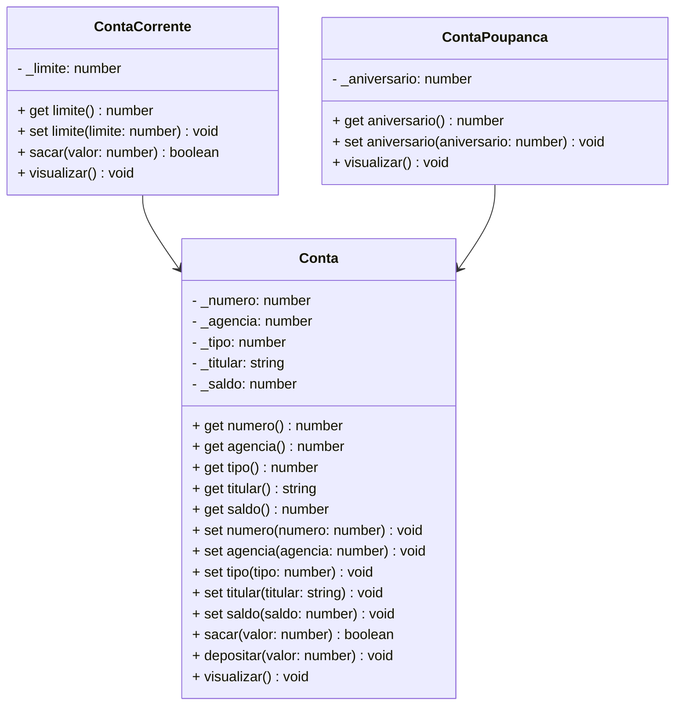

# Projeto Conta Bancária - TypeScript & POO

## Simulador Educacional de Sistema Bancário | Portfólio Profissional

<br />

<div align="center">
	
</div>
<br />

<div align="center">
  
  
  
  
  
  
  
</div>


------

<br />


O **Projeto Conta Bancária** é um projeto **educacional** desenvolvido em **TypeScript**, com foco em **Programação Orientada a Objetos (POO)** e **arquitetura modular**, simulando operações bancárias reais como **CRUD de contas, transferências, depósitos e saques**.

**Objetivo:** Demonstrar **organização, domínio técnico, modelagem de domínio e boas práticas de engenharia de software** em um case prático de portfólio.

<br />

> [!WARNING]
>
> Este projeto possui **fins educacionais** e **não representa um sistema bancário real**. Foi desenvolvido para **aprendizado, demonstração técnica e portfólio profissional**.

<br />

Este projeto foi estruturado para:

- Demonstrar **competência técnica em TypeScript**
- Aplicar **POO em um cenário realista**
- Evidenciar **arquitetura limpa e organização de código**
- Simular **regras de negócio financeiras**
- Servir como **case técnico para recrutadores**

<br />

## Competências Técnicas Demonstradas


- Programação Orientada a Objetos (Encapsulamento, Herança, Polimorfismo)
- Modelagem de domínio orientada a objetos
- Arquitetura em camadas (**Model, Repository, Controller**)
- Tipagem forte com **TypeScript**
- Separação de responsabilidades
- Boas práticas de código e organização modular
- Simulação de regras financeiras
- Validação de entradas e controle de fluxo
- Estrutura pronta para evolução futura (API, DB, testes)

<br />

## Impacto Técnico e Métricas


| Indicador                     | Valor                         |
| ----------------------------- | ----------------------------- |
| Linhas de código              | +600                          |
| Classes principais            | 3                             |
| Funcionalidades implementadas | 9                             |
| Conceitos POO aplicados       | 6+                            |
| Camadas arquiteturais         | Model, Repository, Controller |
| Persistência                  | Simulada em memória           |
| Complexidade lógica           | Média                         |
| Uso educacional               | ✅                            |

<br />

## Funcionalidades do Projeto


| Funcionalidade                  | Status |
| ------------------------------- | ------ |
| CRUD de contas bancárias        | ✅      |
| Conta Corrente e Conta Poupança | ✅      |
| Depósitos e Saques              | ✅      |
| Transferência entre contas      | ✅      |
| Consulta por número             | ✅      |
| Consulta por titular            | ✅      |
| Regras de saldo e limite        | ✅      |
| Interface CLI interativa        | ✅      |

<br />

## Diagrama de Classes




<br />

## Arquitetura do Projeto


Estrutura organizada para facilitar **manutenção, escalabilidade e leitura técnica**:

```text
📦 conta_bancaria
 ┣ 📂 src
 ┃ ┣ 📂 controller     # Regras de aplicação
 ┃ ┣ 📂 model          # Entidades de domínio
 ┃ ┣ 📂 repository     # Persistência simulada
 ┃ ┗ 📂 util           # Utilidades e helpers
 ┣ 📜 Menu.ts          # Ponto de entrada da principal
 ┗ 📜 tsconfig.json
```

<br />

## Tecnologias Utilizadas


- **Linguagem & Runtime**

  - TypeScript
  - Node.js
  - ts-node

- **Ferramentas & Qualidade**
  - Git & GitHub
  - Mermaid (diagramas UML)
  - CLI interativa (terminal)

<br />

## Como Executar


**1️⃣ Clone o repositório**

```bash
git clone https://github.com/rafaelq80/conta_bancaria_tjs13.git
```

**2️⃣ Acesse a pasta do projeto via terminal**

```bash
cd conta_bancaria_tjs13
```

**3️⃣ Instale as dependências**

```bash
npm install
```

**4️⃣ Execute a aplicação**

```bash
ts-node Menu.ts
```

<br />

## Implementações Futuras


- [ ]  Persistência com banco de dados
- [ ]  Testes automatizados (Jest)
- [ ]  API REST com NestJS
- [ ]  Interface Web (React)
- [ ]  Dockerização
- [ ]  CI/CD com GitHub Actions

<br />

## Contribuições


Sugestões, melhorias e pull requests são bem-vindos.

Você pode contribuir com:

- Melhorias arquiteturais
- Refatorações
- Testes automatizados
- Documentação

<br />

## Licença


Este projeto está sob licença **MIT** — livre para uso educacional e profissional.

<br />

##  Autor


**Carlos Brenno — Desenvolvedor Front-end**

🔗 **GitHub:** 

🔗 **LinkedIn:** 

Projeto desenvolvido para **aprendizado contínuo**, **demonstração técnica** e **portfólio profissional**.
